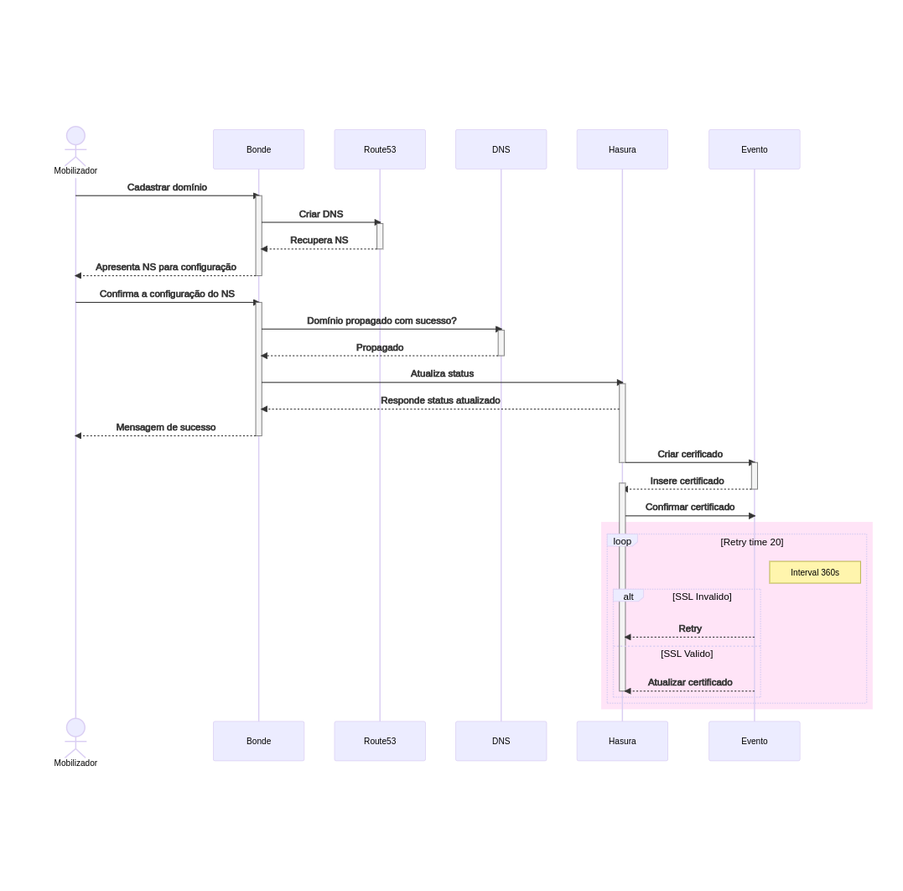

# Cadastrar domínio



```
sequenceDiagram
    actor Mobilizador
    participant Bonde
    participant Route53
    participant DNS
    participant Hasura
    participant Evento

    Mobilizador->>Bonde: Cadastrar domínio
    activate Bonde
    Bonde->>Route53: Criar DNS
    activate Route53
    Route53-->>Bonde: Recupera NS
    deactivate Route53
    Bonde-->>Mobilizador: Apresenta NS para configuração
    deactivate Bonde

    Mobilizador->>Bonde: Confirma a configuração do NS
    activate Bonde
    Bonde->>DNS: Domínio propagado com sucesso?
    activate DNS
    DNS-->>Bonde: Propagado
    deactivate DNS
    Bonde->>Hasura: Atualiza status
    activate Hasura
    Hasura-->>Bonde: Responde status atualizado
    Bonde-->>Mobilizador: Mensagem de sucesso
    deactivate Bonde
    Hasura->>Evento: Criar cerificado
    deactivate Hasura
    activate Evento
    Evento-->>Hasura: Insere certificado
    activate Hasura
    deactivate Evento
    Hasura->>Evento: Confirmar certificado
    rect rgb(255, 228, 247)
    loop Retry time 20
    Note right of Evento: Interval 360s
    alt SSL Invalido
        Evento-->>Hasura: Retry
    else SSL Valido
        Evento-->>Hasura: Atualizar certificado
    deactivate Hasura
    end
    end
    end
```